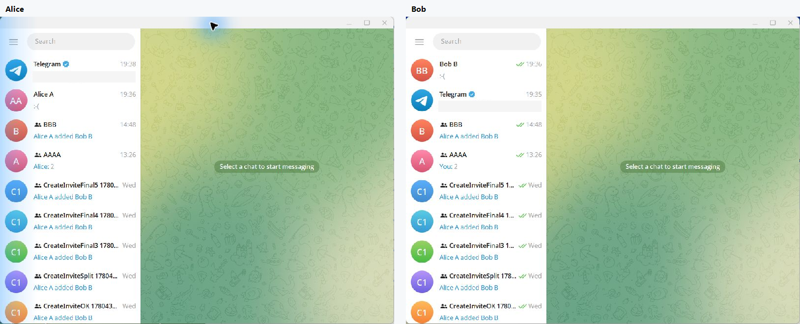

# telesrv

`telesrv` is a Telegram-like MTProto server written in Go. It uses
[`github.com/gotd/td`](https://github.com/gotd/td) v0.144.0 / Layer 225 as the TL
and MTProto base, and its first compatibility target is a pinned Telegram
Desktop build.

`telesrv` is an independent, unofficial project. It is not affiliated with,
endorsed by, or sponsored by Telegram or the official Telegram team.

[中文 README](README.zh-CN.md)



## Status

This project is useful for local protocol research and Telegram Desktop
compatibility work. It is not a production Telegram replacement.

Implemented main paths include MTProto key exchange, login with a development
code, users/contacts/dialogs, private messages, supergroups/channels, update
difference recovery, local media/files, profile/channel photos, stickers,
reactions, and presence. Large-scale public channels, multi-DC/file-DC/CDN,
Bot API, payments, stories, Premium business logic, production abuse controls,
and production object storage are intentionally out of scope for now.

## Contributing

Contributions are very welcome. The most helpful areas right now are Telegram
Desktop compatibility reports, reproducible RPC traces, focused bug fixes,
tests for online/offline update behavior, performance work on already
implemented paths, and documentation that makes local setup easier.

Please keep changes scoped and compatibility-driven. If a change affects
Telegram Desktop behavior, include the client version/commit, the RPC path you
tested, and whether server logs stayed free of `NOT_IMPLEMENTED`, `Unhandled
RPC`, `bad_msg`, panic, or internal errors.

## Repository Layout

```text
cmd/telesrv/              server entrypoint
deploy/                   docker-compose and PostgreSQL migrations
internal/mtprotoedge/     MTProto transport, auth key, session, ack/resend
internal/rpc/             TL router and Telegram Desktop compatibility handlers
internal/app/             domain services
internal/domain/          protocol-independent domain models
internal/store/           store interfaces and memory/postgres/redis backends
docs/                     compatibility notes and module design docs
```

## Run telesrv

Requirements:

- Go 1.25 or newer
- Docker Desktop or Docker Engine with Compose
- OpenSSL, if you want to build a matching Telegram Desktop client

Start PostgreSQL and Redis:

```powershell
docker compose -f deploy/docker-compose.yml up -d
```

Build and run the server:

```powershell
go build -o bin/telesrv.exe ./cmd/telesrv
.\bin\telesrv.exe
```

On first start, `telesrv` creates `data/server_rsa.pem`, applies all database
migrations, seeds bundled language packs, and listens on `0.0.0.0:2398`.

Useful development environment variables:

| Variable | Default | Meaning |
|---|---:|---|
| `TELESRV_LISTEN` | `0.0.0.0:2398` | MTProto listen address |
| `TELESRV_ADVERTISE_IP` | `127.0.0.1` | IP written into `help.getConfig` |
| `TELESRV_DC` | `2` | self-hosted DC id |
| `TELESRV_DEV_AUTH_CODE` | `12345` | fixed login code for local development |
| `TELESRV_POSTGRES_DSN` | local Compose DSN | PostgreSQL connection string |
| `TELESRV_REDIS_ADDR` | `localhost:6399` | Redis address |
| `TELESRV_STICKER_SEED_DIR` | `data/sticker-seed` | optional exported sticker/reaction seed directory |

The optional sticker seed directory is skipped when it does not exist.

## Build Telegram Desktop For telesrv

The stock Telegram Desktop binary will not connect to `telesrv`: it trusts
Telegram's production DC list and RSA keys. Build your own patched client.

Target baseline:

- Telegram Desktop commit: `9caf32dffc90ddd9bb08ad5777b865f729fa167b`
- TL layer: 225
- Local DC: `127.0.0.1:2398`, DC id `2`

Clone and pin Telegram Desktop:

```powershell
git clone --recursive https://github.com/telegramdesktop/tdesktop.git
cd tdesktop
git checkout 9caf32dffc90ddd9bb08ad5777b865f729fa167b
git submodule update --init --recursive
```

Build prerequisites and exact platform instructions are maintained upstream:

- Windows: `docs/building-win.md`
- macOS: `docs/building-mac.md`
- Linux: `docs/building-linux.md`

For Windows x64, the pinned upstream instructions currently boil down to:

```powershell
Telegram\build\prepare\win.bat
cd Telegram
configure.bat x64 -D TDESKTOP_API_ID=YOUR_API_ID -D TDESKTOP_API_HASH=YOUR_API_HASH
```

Then open `out\Telegram.slnx` in Visual Studio and build the `Telegram`
project. The debug binary is written to `out\Debug\Telegram.exe`.

## Patch Telegram Desktop

After `telesrv` has generated `data/server_rsa.pem`, export the matching public
key:

```powershell
openssl rsa -in data/server_rsa.pem -RSAPublicKey_out -out data/server_rsa.pub
```

Patch Telegram Desktop file
`Telegram/SourceFiles/mtproto/mtproto_dc_options.cpp`:

1. Replace built-in production and test DC lists with local DC 2:

```cpp
const BuiltInDc kBuiltInDcs[] = {
    { 2, "127.0.0.1", 2398 },
};

const BuiltInDc kBuiltInDcsIPv6[] = {
    { 2, "::1", 2398 },
};

const BuiltInDc kBuiltInDcsTest[] = {
    { 2, "127.0.0.1", 2398 },
};

const BuiltInDc kBuiltInDcsIPv6Test[] = {
    { 2, "::1", 2398 },
};
```

2. Replace both `kPublicRSAKeys` and `kTestPublicRSAKeys` with the contents of
   `data/server_rsa.pub`.
3. In `DcOptions::constructFromBuiltIn()`, add `Flag::f_tcpo_only` to the IPv4
   and IPv6 built-in DC flags.

Keep this client patch minimal: DC endpoints, RSA key, and TCP-only flags only.
Do not mix UI changes into the protocol patch.

## Run Two Local Desktop Clients

Use separate TDesktop working directories so Alice and Bob do not share `tdata`:

```powershell
$tdesktop = "C:\path\to\tdesktop\out\Debug\Telegram.exe"
Start-Process $tdesktop -ArgumentList @("-workdir", "$PWD\.tdata-alice")
Start-Process $tdesktop -ArgumentList @("-workdir", "$PWD\.tdata-bob")
```

Log in with two different phone numbers. In local development, the login code is
`12345` unless you changed `TELESRV_DEV_AUTH_CODE`.

If the client keeps reconnecting, check these first:

- `telesrv` is listening on port `2398`.
- `data/server_rsa.pub` was copied into both RSA key arrays in TDesktop.
- `TELESRV_ADVERTISE_IP` matches the address reachable from the client.
- TDesktop was built from the pinned Layer 225 baseline or re-audited for a new
  layer.

## Documentation

- [Compatibility matrix](docs/compatibility-matrix.md)
- [Telegram Desktop patch notes](docs/tdesktop-patch-notes.md)
- [Persistence layer](docs/persistence-layer.md)
- [Message module](docs/message-module.md)
- [Channel module](docs/channel-module.md)
- [Performance audit](docs/performance-audit.md)
